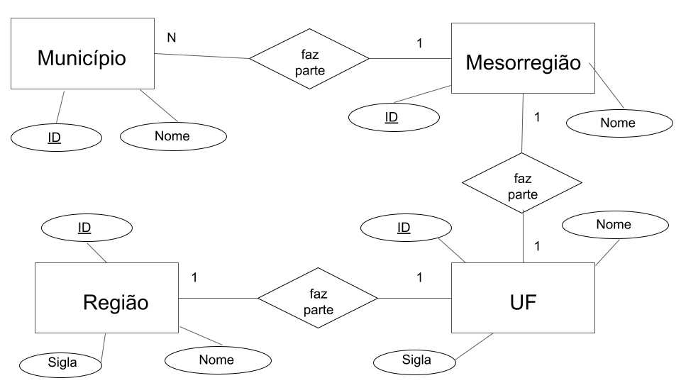

# Apresentação do Lab01 - API Acesso

Estrutura de pastas:

~~~
├── README.md  <- arquivo apresentando a tarefa
│
├── images     <- arquivo de imagem da tarefa
│
└── notebook   <- arquivos do notebook
~~~

# Aluno
* Matheus Augusto da Silva Cândido
* Ra: 241640

## Tarefa 1 sobre APIs de acesso

> 

## Tarefa 2 sobre Engenharia Reversa
> Coloque a imagem do PNG do seu diagrama como ilustrado abaixo (a imagem estará na pasta `image`):
>
> 
