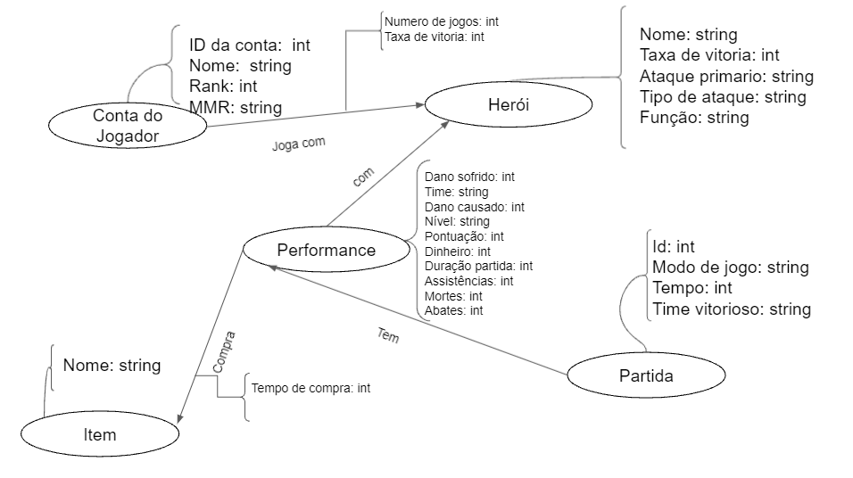

# Lab07 - Modelo Lógico para Banco de Dados de Grafos

Estrutura de pastas:

~~~
├── README.md  <- arquivo apresentando a tarefa
│
└── images     <- arquivos de imagem usados na tarefa
~~~

# Aluno
* `RA 241640`: `Matheus Augusto da Silva Cândido`

## Modelo Lógico do Banco de Dados de Grafos

> 

## Perguntas de Pesquisa/análise

> Liste aqui as três perguntas de pesquisa/análise
> * Pergunta 1: Qual a relação entre o herói utilizado e o desempenho de um jogador?
> * Pergunta 2: Possivel média de tempo de cada partida para um bom desempenho de um jogador
> * Pergunta 3: Relação entre os itens adquiridos na partida e a performance