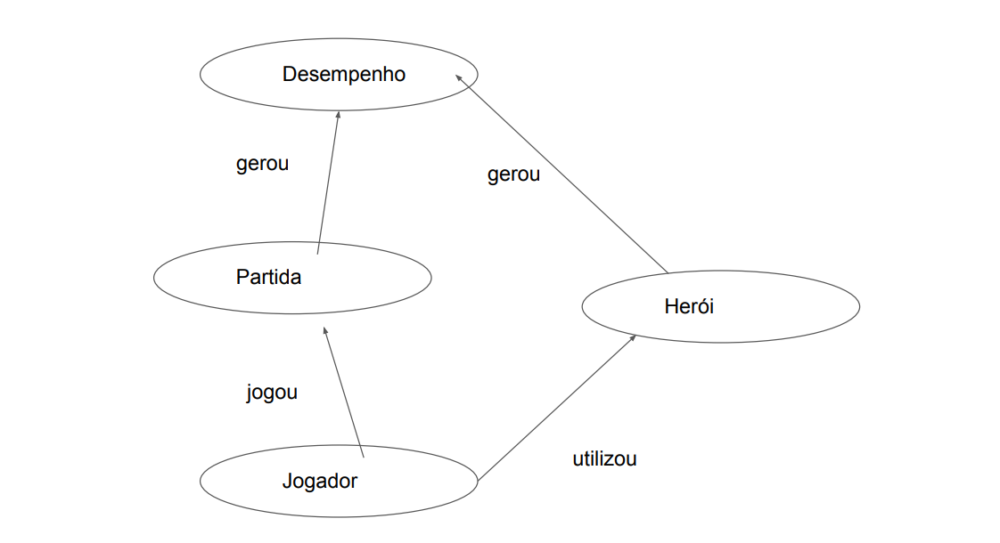

# Apresentação do Lab09 - Grafo de Conhecimento

Estrutura de pastas:

~~~
├── README.md  <- arquivo apresentando a tarefa
│
└── images     <- arquivos de imagem usados na tarefa
~~~

# Aluno
* `241640`: `Matheus Augusto da Silva Cândido`

## Exemplo de Grafo de Conhecimento - para publicar ou enriquecer

> 

## Perguntas de Pesquisa ou Queries

> Liste aqui as três perguntas de pesquisa ou queries
> * Identificar qual partida um usuário jogou no histórico de registros
> * Identificar o desmpenho que uma partida gerou para um jogador
> * Identificar o desempenho obtido por um joggador utilizando um determindado herói